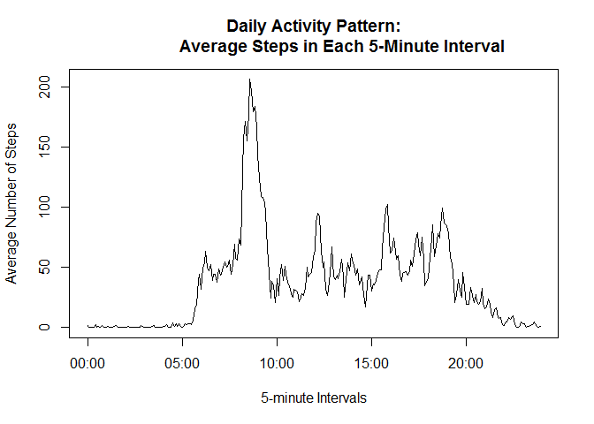
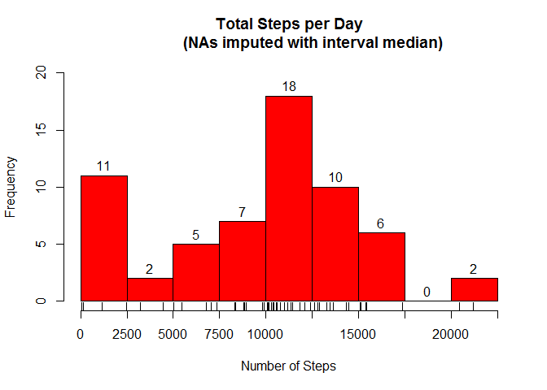
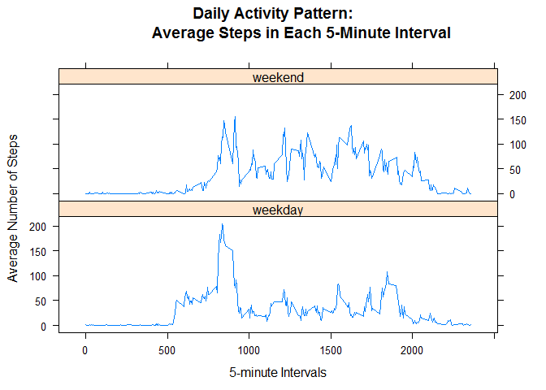

# Reproducible Research: Peer Assessment 1
Will Streyer  
## Load libraries

```r
require(dplyr)
require(readr)
require(stringr)
require(lubridate)
require(lattice)
```

## Loading and preprocessing the data

### Load data

```r
unzip("activity.zip")
act <- read_csv("activity.csv", col_types = "iDi")
```

### Convert interval to time

```r
act <- mutate(act, t=str_pad(interval,4,pad = "0"))
act <- mutate(act, t=paste0(substr(t, 1,2), ":", substr(t, 3,4)))
act <- mutate(act, t=as_datetime(hm(t)))
```

## What is mean total number of steps taken per day?

### Histogram of total daily steps

```r
steps_tot <- act %>% group_by(date) %>% summarize(tot=sum(steps, na.rm=TRUE))
hist(steps_tot$tot, breaks=seq(0,22500, 2500), 
     xaxp = c(0,22500, 9), col="red", 
     labels = TRUE, ylim = c(0,20),
     xlab = "Number of Steps",
     main = "Total Steps per Day")
rug(steps_tot$tot)
```

<!-- -->

### Mean and median of total daily steps

```r
print(paste0("mean: ", as.integer(mean(steps_tot$tot))))
```

```
## [1] "mean: 9354"
```

```r
print(paste0("median: ", as.integer(median(steps_tot$tot))))
```

```
## [1] "median: 10395"
```

## What is the average daily activity pattern?

### Plot the average daily activity pattern

```r
steps_int <- act %>% group_by(t) %>% summarise(avg=mean(steps, na.rm=TRUE))
plot(steps_int$t, steps_int$avg, type="l",
     xlab="5-minute Intervals",
     ylab="Average Number of Steps",
     main = "Daily Activity Pattern:
             Average Steps in Each 5-Minute Interval")
```

<!-- -->

### The most active period of the day

```r
max_t <- which.max(steps_int$avg)
t1 <- steps_int[[max_t, "t"]]
t2 <- steps_int[[(max_t+1), "t"]]
max_avg <- steps_int[[(max_t+1), "avg"]]
print(paste0("Most active interval: ", hour(t1), ":", minute(t1), 
             "-", hour(t2), ":", minute(t2), " - ", as.integer(max_avg), " steps"))
```

```
## [1] "Most active interval: 8:35-8:40 - 195 steps"
```

## Imputing missing values

###Determine the number of missing values

```r
NAs <- sum(is.na(act$steps))
print(paste0("Number of missing values: ", NAs, " or ",
            as.integer(NAs/nrow(act)*100), "%"))
```

```
## [1] "Number of missing values: 2304 or 13%"
```

### Calculate the interval median across days and merge into original data set

```r
steps_int <- act %>% group_by(interval) %>% summarise(med=median(steps, na.rm=TRUE))
act <- merge(act, steps_int, by="interval") 
act <- arrange(act, date, interval)
```

### Locate NA values and replace with the median value for that interval

```r
NAs <- is.na(act$steps)
act[NAs, "steps"] <- act[NAs, "med"]
```

### Recompute total steps per day

```r
steps_tot <- act %>% group_by(date) %>% summarize(tot=sum(steps))
hist(steps_tot$tot, breaks=seq(0,22500, 2500), 
     xaxp = c(0,22500, 9), col="red", 
     labels = TRUE, ylim = c(0,20),
     xlab = "Number of Steps",
     main = "Total Steps per Day
            (NAs imputed with interval median)")
rug(steps_tot$tot)
```

<!-- -->

```r
print(paste0("mean: ", as.integer(mean(steps_tot$tot))))
```

```
## [1] "mean: 9503"
```

```r
print(paste0("median: ", as.integer(median(steps_tot$tot))))
```

```
## [1] "median: 10395"
```

## Are there differences in activity patterns between weekdays and weekends?

### Create a factor to categorize dates as weekday or weekend

```r
act <- mutate(act, is.weekend = ifelse(weekdays(date) %in% c("Saturday", "Sunday"), TRUE, FALSE))
act <- mutate(act, is.weekend = factor(is.weekend, labels = c("weekday", "weekend")))
```

### Summarize across intervals and section of week

```r
steps_int <- act %>% group_by(interval,is.weekend) %>% summarise(avg=mean(steps))
```

### Plot daily activity pattern for weekdays and weekends

```r
xyplot(avg~interval|is.weekend, data = steps_int,
       type = "l", layout=c(1,2),
       xlab ="5-minute Intervals",
       ylab ="Average Number of Steps",
       main ="Daily Activity Pattern:
              Average Steps in Each 5-Minute Interval")
```

<!-- -->


